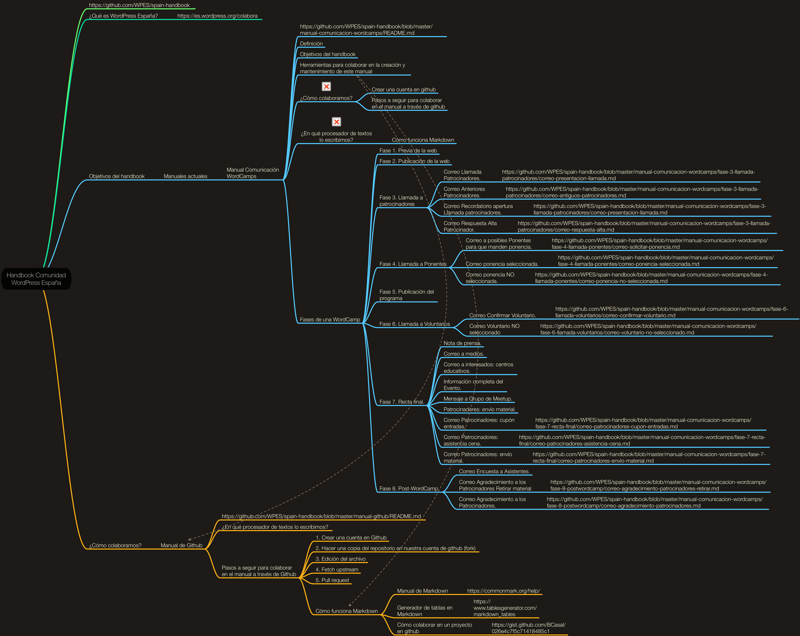

# Handbook Comunidad WordPress España

## ¿Qué es WordPress España?
La comunidad de WordPress España es un grupo de personas que colaboran en el desarrollo de WordPress.org, organizamos la documentación estandar, a la que llamamos manuales o "HandBook".

La finalidad es unificar criterios a la hora de desarrollar los distintos proyectos/formas de organizar.

Este Manual recoje, a su vez, los diferentes manuales exitentes que ha generado la comunidad WordPress España a lo largo de los años. Lo tienes disponibles a continuación.
Tu también puedes colaborar [Sección Colabora] (https://es.wordpress.org/colabora)

## Objetivos del handbook
Para organizar los manuales y guías, hemos creado este repositorio para la comunidad de WordPress España.

Manuales actuales:
- [Manual de Comunicación para WordCamps](manual-comunicacion-wordcamps/README.md)

## ¿Cómo colaboramos?
### Alojamiento y control de versiones de los manuales (handbooks)
Colaboraremos a través de un repositorio en Github. Hemos propuesto este sistema porque es el mejor para llevar un control de las aportaciones y las diferentes versiones del documento. Este es el sistema mediante el cual millones de programadores en el mundo han construido cosas tan chulas como WordPress. ¿Por qué no aprender nosotros de ellos?

A continuación te contamos cómo empezar en **Github**, desde darte de alta hasta finalizar tu colaboración.

- [Manual GitHub](manual-github/README.md)

## ¿Que herramientas utilizamos?

Si tienes un conocimiento más avanzado de GIT, puedes editar tu fork del repositorio directamente en local con cualquier editor de código como Visual Studio Code, Atom, Sublime text, etc.

### Escritura de los textos del manual

El editor de texto que utiliza Github está basado en *Markdown*, un tipo de codificación muy sencilla que te permitirá dar formato al texto plano. Para aprender lo poco que necesitas conocer de Markdown, a la hora de escribir en github, te recomendamos que eches un vistazo a este [Manual de Markdown](https://commonmark.org/help/) y que hagas el tutorial de 10 minutos.

Como escribir tablas en Markdown es engorroso, puedes utilizar como apoyo este [generador de tablas en Markdown](https://www.tablesgenerator.com/markdown_tables).

### Comunicación entre los miembros del equipo de Marketing

La herramienta habitual de comunicación entre miembros voluntarios es **Slack**. Si quieres saber cómo darte de alta en esta herramienta o cómo entrar en los grupos de colaboración de WordPress en Slack, sigue [este tutorial](https://es.wordpress.org/guias/chat/).

**Nota**: De forma provisional, durante la realización de este handbook, hemos añadido un mapa mental para facilitar la visualización rápida de su estructura.

[Mapa mental del repositorio de manuales de WPES en pdf](assets/Mapa-mental-WPES.pdf)

