# Manual de GitHub

Los manuales de este repositorio son el resultado de un trabajo colaborativo. Para ello es necesario usar herramientas como GitHub, que permite el registro y control de versiones.

Este manual pretende ser una guía de introducción a GitHub para principiantes. Para obtener información más completa se puede visitar la página oficial [GitHub Documentation](https://docs.github.com/es).

## <a name="top">Guía de uso de Github</a>

1. [Crear una cuenta en GitHub](#paso1)
   * 1.1. [Enlazar perfiles WordPress y GitHub](#paso1-1)
2. [Trabajar en repositorio](#paso2)
   * 2.1. [Hacer una copia del repositorio en nuestra cuenta de GitHub (fork)](#paso2-1)
3. [Edición del archivo](#paso3)
   * 3.1. [Editar](#paso3-1)
   * 3.2. [Fetch upstream](#paso3-2)
   * 3.3. [Pull request](#paso3-3)
   * 3.4. [Aceptación de los cambios propuestos (solo Administradores)](#paso3-4)
4. [Gestión de proyectos](#paso4)
   * 4.1. [Crear y personalizar issues](#paso4-1)
   * 4.2. [Consultar *issues*](#paso4-2)
   * 4.3. [Organizar *issues* en Proyectos](#paso4-3)


## <a name="paso1">1. Crear una cuenta en GitHub</a>

Para crearte una cuenta en GitHub, debes ir a su página principal [github.com](https://github.com/) y crearte una cuenta.

Nos damos de alta en GitHub a través de la opción de *“Sign up”* que está rodeada con un círculo rojo.


Una vez que hemos creado nuestra cuenta, ya podemos acceder el repositorio donde está ubicado el manual dentro de GitHub, que se encuentra en [WPES/spain-handbook](https://github.com/WPES/spain-handbook).

[Volver arriba](#top)

### <a name="paso1-1">1.1. Enlazar perfiles WordPress y GitHub</a>

Para enlazar ambos perfiles es necesario loguearse en https://es.wordpress.org/


Pinchamos en la opción “Editar el perfil” que aparece en la parte superior a la derecha.


A continuación, podemos ver la información de nuestro perfil.


Y en el apartado *GitHub Username* podemos ver un enlace que permite vincular la cuenta de WordPress con la de GitHub, al pinchar sobre este enlace.


Se abrirá una ventana como la siguiente donde debemos autorizar el acceso al perfil de WordPress.org


[Volver arriba](#top)

## 2. <a name="paso2">Trabajar en repositorio</a>

Una vez registrados podemos acceder a la página principal de [GitHub](https://github.com/) y en la barra lateral aparecerá el listado de repositorios a los que tenemos acceso.

Pinchamos en [WPES/spain-handbook](https://github.com/WPES/spain-handbook) para acceder al repositorio de manuales de WordPress España. En la parte superior izquierda podremos ver en todo momento en qué repositorio estamos.

Con el fin de evitar posibles errores o conflictos **es importante no trabajar nunca directamente en este repositorio principal**. Para poder editar con seguridad, crearemos una copia del repositorio principal (*fork*) que será donde trabajaremos.

[Volver arriba](#top)

### <a name="paso2-1">2.1. Hacer una copia del repositorio en nuestra cuenta de GitHub (*fork*)</a>

Crearemos el *fork* pinchando en el último botón que aparece en la parte superior derecha, está rodeado en azul para que puedas localizarlo más fácilmente.


Después de realizarlo, la ventana cambiará y si nos fijamos en la ruta que se muestra en la parte de arriba a la izquierda ya aparecerá nuestro nombre de usuario, desde este momento cualquier cambio que hagamos en este repositorio, no afectará al repositorio original hasta que no hagamos un *Pull request* y éste no sea verificado y aprobado.


[Volver arriba](#top)

## <a name="paso3">3. Edición del archivo</a>

### <a name="paso3-1">3.1. Editar:</a>

#### **Para editar:**

Una vez creado nuestro *fork* podemos proceder a editar el archivo, para ello pulsaremos el icono en forma de lápiz.


#### **Para validar los cambios de edición:**

Al terminar la edición, para guardar los cambios, debemos ir al final de la página, rellenar los campos correspondientes a *commit changes* y pulsar *Commit changes*.

Si queremos añadir los cambios en nuestro *fork*, dejaremos seleccionada la opción "*Commit directly to the master branch.*". De lo contrario estaríamos creando una nueva rama a partir de nuestro *fork*.


[Volver arriba](#top)

#### <a name="paso3-1-1">3.1.1. Inserción de imágenes</a>

Para insertar imágenes en el manual, éstas se subirán a la carpeta **assets** que se encuentra en la misma carpeta donde está el documento donde se va a insertar dicha imagen.

A continuación, se referenciará la imagen con el comando correspondiente de *Markdown*, como se muestra a continuación:

``````

El enrutamiento se hará de forma relativa, *nunca se copiará y se pegará la ruta directamente desde *GitHub**.

Se muestra a continuación un ejemplo en el que la imagen quedará de la siguiente forma:


Lo más importante es que hay que subir la imagen a la carpeta **assets** que se encuentre en la misma carpeta que el documento que se esté editando en ese momento. Para ello, hay que hacer clic sobre dicha carpeta hasta que veamos los archivos que hay dentro.

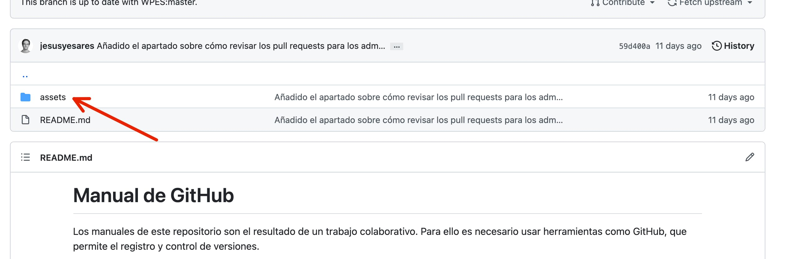

A continuación, hay que hacer clic en el botón *Add file*, del que se desplegará un submenú. A continuación hay que hacer clic en el botón *Upload files*. De esta forma, aparecerá la página de subida de imágenes.

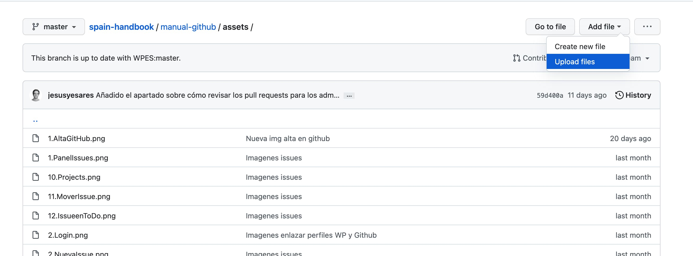

Para subir la imagen es suficiente arrastrarla desde el ordenador hasta el área habilitada para ello, en la que indica el mensaje *Drag additional files herre to add them to your repository*. También se puede subir a través del enlace *choose your files*.

Una vez subida la imagen, hay que rellenar la descripción del *commit* para aclarar de qué se trata la imagen*, y finalmente habrá que hacer clic en el botón *commit changes*.


Por último, para insertar la imagen en el texto, se usará el código *markdown* visto anteriormente. Por ejemplo, la imagen con la que se ha iniciado este ejemplo se llama **1.AltaGitHub.png**, y el texto alternativo que se le ha añadido es "Alta cuenta Github". Por tanto, el código utilizado es el que se muestra en la siguiente imagen.


El resultado será el que se muestra al principio de este apartado.

Como puede verse, es muy importante añadir siempre la ruta relativa y no una ruta absoluta que lleve al fork personal o a cualquier otra ruta fuera del repositorio de WPES.

[Volver arriba](#top)

#### <a name="paso3-2-2">3.2.2. Reducir el tamaño de las imágenes</a>

Aunque *GitHub* es muy potente y soporta imágenes de gran tamaño, es importante subir las imágenes reducidas para mejorar la experiencia del usuario que consulte el manual.

Por ello, se va a explicar a continuación una forma muy sencilla de reducir el tamaño de estas imágenes que se van a subir durante la edición de los manuales. Para ello se va a utilizar una aplicación gratuita: https://squoosh.app.

Con esta aplicacion solamente se puede redimensionar la imagen y reducir su tamaño de archivo (peso).

En cualquiera de los casos, una vez que se haya entrado en **Squoosh.app**, lo siguiente será pegar desde el portapapeles o arrastrar la imagen a la aplicación.


Al añadir la imagen, se observa a la izquierda el peso original de la misma, y a la derecha el peso y la reducción que aplicado el software. Se observa una reducción considerable solo por añadir la imagen a squoosh.app


##### Redimensionar una imagen

Si la imagen que se va a insertar es excesivamente grande en dimensiones, esto no tendrá mucho sentido, lo máximo que se mostrará será una imagen de unos 2400px. Para ello, hay una opción llamada *Resize* que sirve para cambiar las dimensiones de la imagen.


Al activar esta opción se observan dos campos que muestran las dimensiones de la imagen. En ese caso, lo único que hay que hacer es ir a *Resize*, activar la opción y cambiar solamente el ancho de imagen (*Width*).


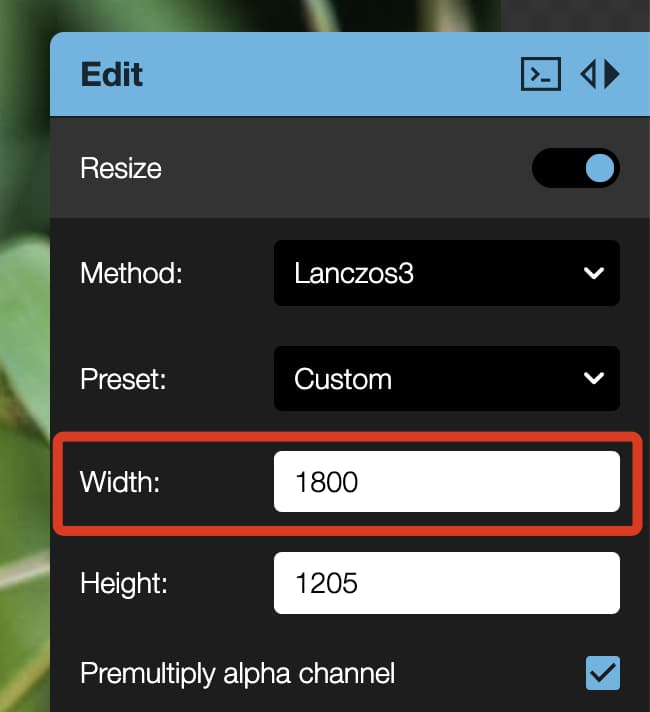

Con este redimensionamiento de imagen veremos que se produce una reducción de tamaño de archivo considerable. 


##### Reducir el tamaño de imagen

Pero además, si no ha hecho falta redimensionar la imagen, pero el peso del archivo sigue siendo alto, existe la opción de cambiar la calidad de la imagen.

Para ello, lo único que hay que hacer es mover el deslizador de *Quality* hacia la izquierda para reducir este tamaño. En todo momento, veremos debajo cuánto se reduce el peso de la imagen.

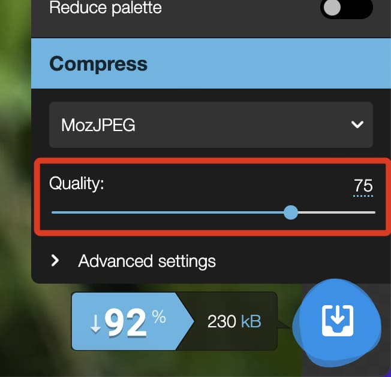

En este ejemplo se observa la calidad de la imagen reducida a 75, que es la reducción que introduce el programa por defecto y el peso de la imagen, que es de 230kb.


A continuación, se observa cómo el peso se reduce a 109kb cuando el deslizador se desplaza a calidad 35.


En la pantalla se ve, sobre la imagen, un divisor que permite ver a la izquierda la imagen a calidad original y, a la derecha, la imagen con la nueva calidad. Lo óptimo es encontrar un punto en el que la imagen no se pixele, pero el peso de la misma no sea demasiado alto.

A continuación se ve cómo, al reducir a calidad 35 la imagen, ha disminuido bastante el peso de la misma, pero no se aprecia pérdida de la calidad sobre la propia imagen.


De esta forma, se podrán subir al manual imágenes optimizadas, pero de calidad. Aunque lo habitual es que solo haya que pasar la imagen por el programa sin necesidad de tocar ningún ajuste.

[Volver arriba](#top)

### <a name="paso3-2">3.2. Fetch upstream</a>

**Si nuestro *fork* deja de estar actualizado:**

Cuando se trabaja en un *fork*, se trabaja paralelamente al archivo máster. Es decir, los cambios producidos en el archivo principal (*master*) no se sincronizan automáticamente con nuestro *fork*.

GitHub nos lo indicará con la siguiente frase:
*“This branch is 8 commits behind WPES:master.”*
Significa que se han realizado 8 modificaciones desde que hicimos nuestra copia (*fork*).

A continuación un ejemplo del aviso:


En este caso, si el archivo principal se ha adelantado a nuestra versión, tenemos dos opciones: *Contribute* o *Fetch upstream*

Si ya hemos editado nuestro archivo, pulsaremos *Contribute*, aparecerá una pequeña ventana que indica que el archivo no está actualizado y nos invita a hacer un *Pull request* para fusionar nuestra edición con el archivo principal (*master*).


Si no hemos realizado aun cambios en nuestro *fork*, para trabajar en la versión aceptada más actualizada del archivo principal (*master*), podemos pulsar en *Fetch Upstream*, que nos dará a su vez dos opciones más: *Compare* o *Fetch and merge*


*Compare* nos permite comparar las distintas versiones que se han creado y *Fetch and merge* sincronizará nuestro *fork* con el archivo principal (*master*). 

En cualquier caso, si hubiera algún conflicto entre ambas versiones, el sistema nos avisará y nos invitará a hacer antes un *Pull request*.

A continuación una imagen de lo que nos mostraría la opción *compare*:


[Volver arriba](#top)

### <a name="paso3-3">3.3 Pull request</a>

Cuando terminamos de editar nuestro archivo podemos proceder a realizar un *pull request*, nuestro archivo se enviará al administrador para su revisión y, una vez realizadas las comprobaciones pertinentes, nuestro *fork* se fusionará con el archivo principal.

Para hacer *pull request* a partir de nuestro *fork*:

1. Ir al repositorio principal y una vez allí, pulsar en *Pull requests*


2. En pantalla aparecerá un listado con los *pull requests* existentes en ese momento (si los hay), para crear el nuestro pulsaremos en *New pull request*


3. En este paso tenemos la oportunidad de comparar el archivo principal con nuestra propuesta, como en nuestro caso lo estamos haciendo desde un *fork*, pulsaremos *compare accross forks*, puesto que necesitamos indicar qué dos archivos vamos a comparar.


4. Nos aparecerá un nuevo encabezado en el que podremos seleccionar nuestro *fork* pulsando en el desplegable *head repository*


5. Si no hay ningún conflicto entre ambas versiones, el sistema nos indicará *Able to merge*, lo que significa que ya podemos pulsar la opción *Create pull request*

.

6. En la siguiente pantalla aparecerá una ventana con los campos *Title* para poner un título a nuestra propuesta y *Write* para añadir los comentarios necesarios. 

Es imprescindible rellenar el campo *Title* para que se habilite la opción *Create pull request*, de lo contrario, la selección permanecerá deshabilitada.


7. Cuando terminamos de rellenar los campos, pulsamos sobre *create pull request* y se abre un desplegable con dos opciones como vemos en la siguiente imagen. 

Dejaremos seleccionada la primera opción si nuestro archivo ya está listo para revisión.


[Volver arriba](#top)

## <a name="paso3-4">3.4. Aceptación de los cambios propuestos (**solo Administradores**)</a>

A la hora de revisar los cambios realizados por los miembros del equipo, los administradores deberán seguir los siguientes pasos:

1. Comprobar que existen solicitudes de cambios (*Pull requests*) en el repositorio. Esto se hará visualizando el número que aparece al lado de la opción *Pull requests* de la barra menú de opciones del propio repositorio y haciendo clic en dicha opción.
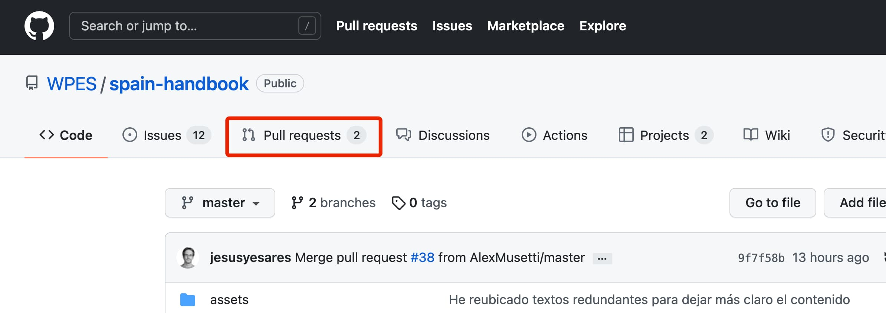

2. Una vez en esta página, se podrán visualizar las solicitudes de cambios disponibles. 


3. Haciendo clic en cada uno de los *pull request*, se podrán visualizar todos los cambios (*commits*) realizados por el colaborador, así como sus comentarios al *pull request* con aclaraciones y explicaciones de los cambios hechos.


4. Para revisar las modificaciones realizadas en cada uno de los *commits*, se hará clic en la pestaña *Files changed*, junto a la cual debe haber un número que indicará la cantidad de cambios realizados. En esta página se pueden ver fragmentos del texto, con los elementos eliminados en color rojo y marcados por un signo - al principio de cada línea, así como los elementos añadidos en color verde y marcados por un signo + al principio de cada línea.
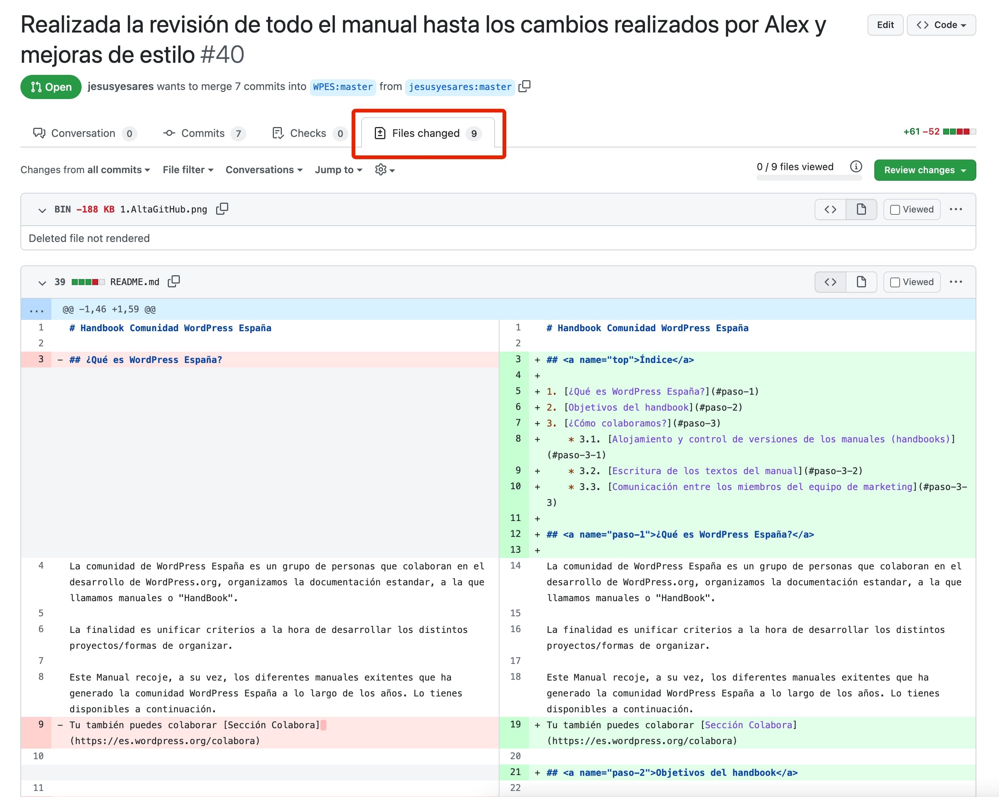

5. El revisor podrá llevar un control de los *commits* revisados o vistos haciendo clic en cada uno de ellos, sobre la casilla *Viewed*. Arriba verá un marcador de la progresión en la revisión de los cambios.
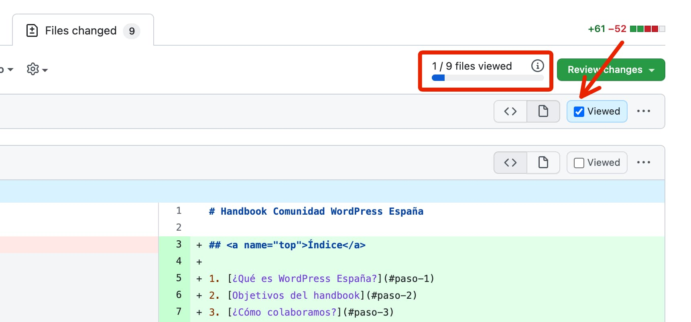

6. Una vez revisados los cambios, el administrador podrá llevar a cabo tres acciones, una vez haga clic en el botón *Review changes*:
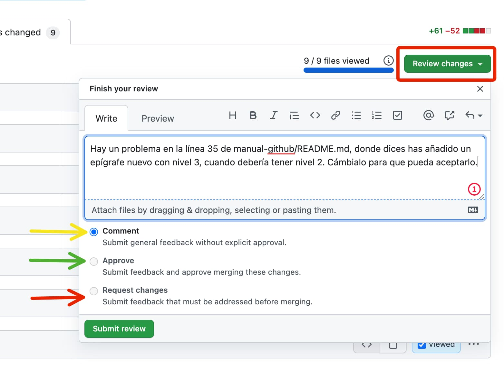
   - Haciendo clic en *Comment* podrá hacer un comentario a los cambios sin aprobar nada.
   - Haciendo clic en *Aprove* aprobará los cambios y éstos se fusionarán con la rama principal del repositorio.
   - Haciendo clic en *Request changes* solicitará cambios al colaborador para que los haga antes de volver a pedir un *pull request*.

   En todos los casos se recomienda comentar para que le quede claro al colaborador en qué situación se encuentra su *pull request*.

7. En ocasiones solo permitirá hacer un comentario, sobre todo si hay algún tipo de conflicto. En ese caso, se verán en gris las opciones *Approve* y *Request changes*. En ese caso, el administrador comentará y hará clic en el botón *Submit review* (Enviar revisión).


8. Finalmente, no olvidemos que el colaborador ha propuesto sus cambios desde su *Fork*, es decir, no está trabajando en el repositorio principal, sino desde el suyo propio. Esto se hace para evitar que haya problemas y que, si se producen choques, éstos se puedan detectar y gestionar sin problema.
Lo normal, por tanto es que aparezca un mensaje de que es necesario **fusionar** (*merge*) las modificaciones solicitadas por el colaborador. El administrador se encargará de hacerlo, revisando antes cualquier posible conflicto que se produzca.
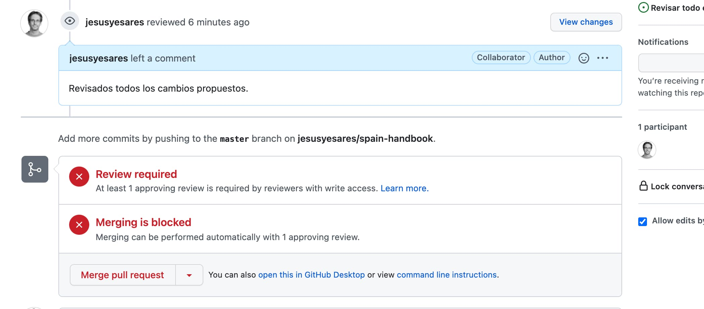

   En ese caso habrá que hacer clic en el botón *Merge pull request*, siempre que los administradores hayan comprobado y estén completamente seguros de que no hay ningún tipo de conflicto.

[Volver arriba](#top)


## <a name="paso4">4. Gestión de proyectos</a>

Al tratarse de un trabajo colaborativo se necesita un alto grado de organización y coordinación. 
GitHub nos permite crear *issues*, que son como tareas o acciones que deben realizarse.

Para facilitar la organización, estas *issues* se agrupan por proyectos. Y con el propósito de mantener la coordinación entre los distintos colaboradores, las *issues* pueden asignarse a personas.

[Volver arriba](#top)

### <a name="paso4-1">4.1. Crear y personalizar issues</a>

En el menú principal de GitHub accedemos al apartado de *Issues* y podemos ver un listado de todas las *issues* ya creadas.
Para crear una nueva *issue* pinchamos en el botón *"New Issue"*.


Se abrirá una ventana, como la que se ve a continuación, con cuatro áreas señaladas: 

1. espacio para introducir el título,  
2. espacio para comentarios,
3. botón de *Submit new issue*,
4. opciones de edición de la *issue*

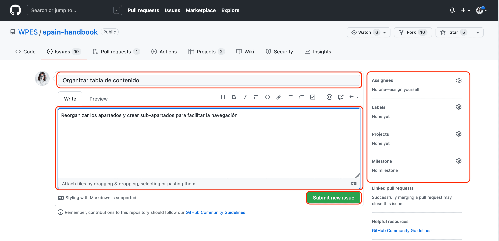

Debemos introducir un título y un breve comentario al respecto, una vez hecho podemos pinchar en *Submit new issue* para guardarla.

Adicionalmente, en el lateral derecho podemos personalizar algunas opciones como *Assignees*, para asignar la *issue* a una persona, *Labels*, para etiquetar/clasificar la *issue*, y finalmente *Projects* para asignar la *issue* al proyecto elegido. 

Para hacerlo pinchamos sobre la rueda correspondiente y se despliega una ventana con las opciones. Seleccionamos nuestra elección y pinchamos fuera del área para que la opción marcada quede guardada.

A continuación varias capturas de ejemplo:

**para seleccionar la persona asignada:**


**para clasificar con etiquetas:**


**para seleccionar el proyecto asignado:**


A continuación una imagen de la *issue* una vez editada y guardada

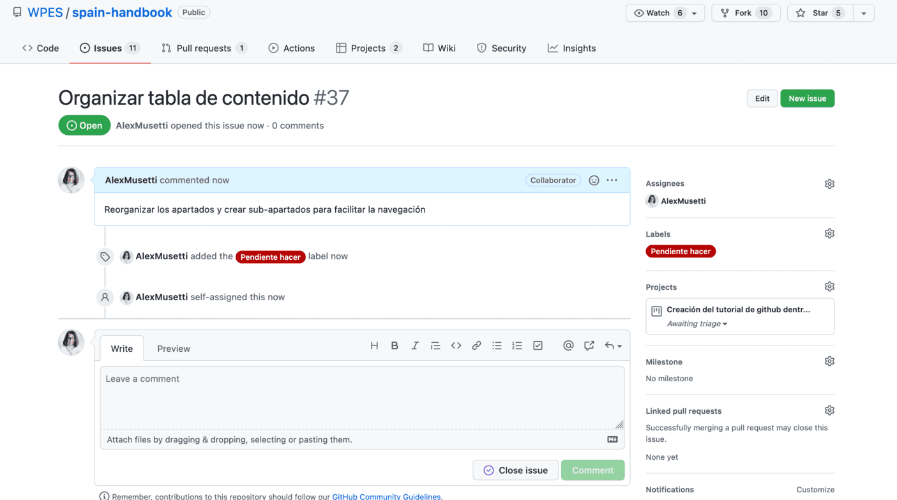

[Volver arriba](#top)

### <a name="paso4-2">4.2. Consultar *issues*</a>

Una vez creada la *issue* podemos ir al [repositorio principal](https://github.com/WPES/spain-handbook) y acceder al listado de *issues* pinchando en *Issues*. 

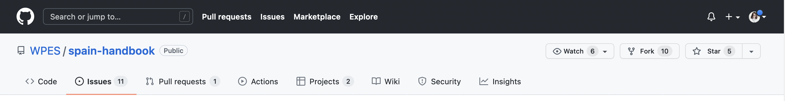

A continuación podemos ver cómo la *issue* recién creada ya aparece en el listado.

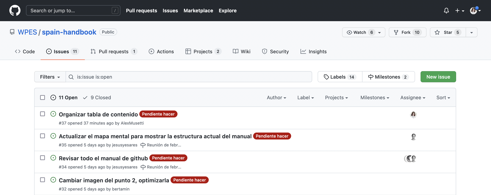

[Volver arriba](#top)

### <a name="paso4-3">4.3. Organizar *issues* en Proyectos</a>

Si accedemos al apartado de *Projects* desde el menú principal de GitHub podremos ver un listado de todas las etiquetas y en qué estado de realización se encuentra cada una de ellas.

En la parte de la derecha aparece la opción "Add cards" con un punto azul, notificando que hay una nueva *issue*.

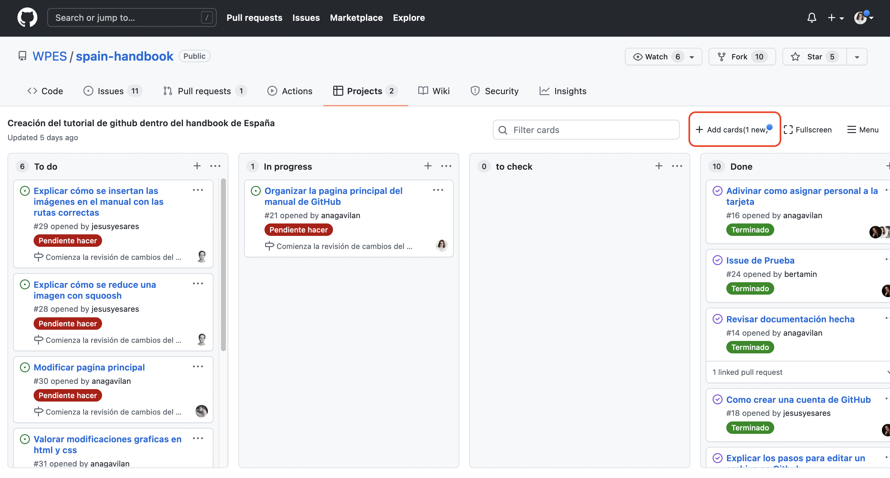

Al pinchar sobre esta opción podemos ver la *issue* que hemos creado y nos permite arrastrarla a la columna correspondiente: *"To Do"*, *"In progress"* y *"Done"*.

Si pinchamos sobre el título azul, saldrá una flecha de 4 puntas que servirá para arrastrar la *issue*.


Aquí podemos ver que la *issue* de prueba ha sido incluida en la columna *“To do”*.


[Volver arriba](#top)


