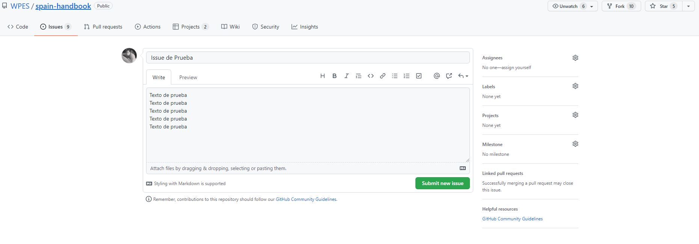
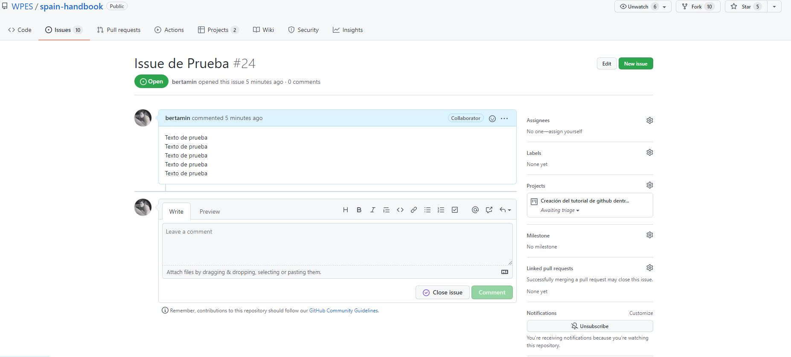
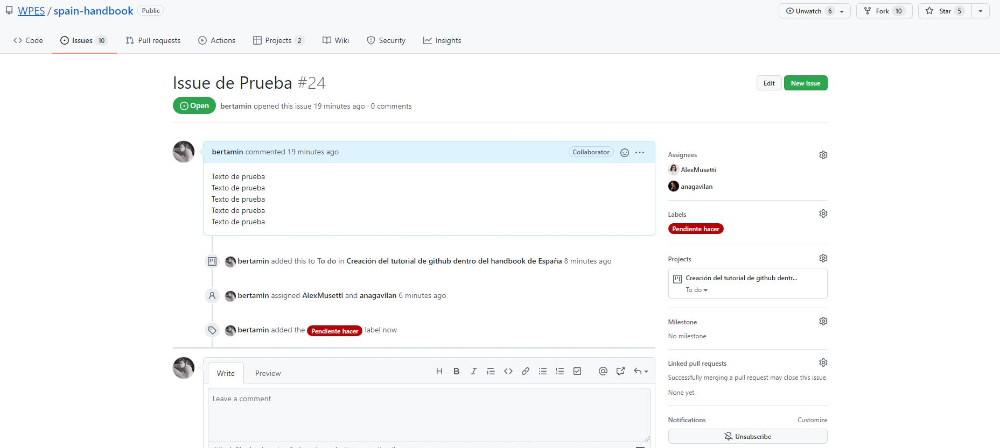
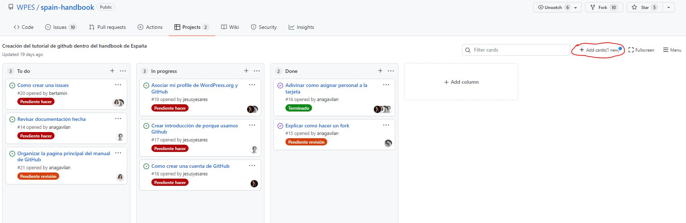
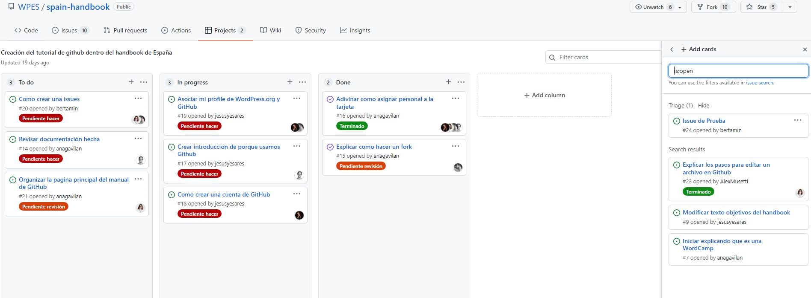
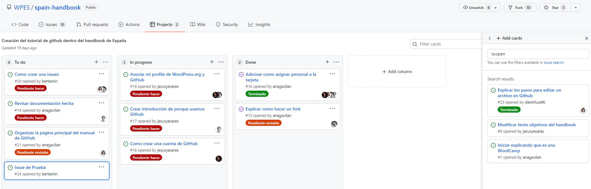

# Manual de Github

Los manuales de este repositorio son el resultado de un trabajo colaborativo. Para ello es necesario usar herramientas como Github, que permite el registro y control de versiones.

Este manual pretende ser una guía de introducción a Github para principiantes, para obtener información más completa se puede visitar la página oficial .

## Guía de uso de Github
1. [Crear una cuenta en Github](#paso1)
2. [Enlazar perfiles WordPress y Github](#paso2)
3. [Hacer una copia del repositorio en nuestra cuenta de github (fork)](#paso3)
4. [Edición del archivo](#paso4)
5. [Fetch upstream](#paso5)
6. [Pull request](#paso6)
7. [Crear y personalizar issues](#paso7)

## 1. Crear una cuenta en Github

Para crearte una cuenta en Github, debes ir a su página principal [github.com](https://github.com/) y crearte una cuenta.

Una vez que hemos creado nuestra cuenta, buscaremos el repositorio donde se encuentra el manual dentro de Github, que se encuentra en [WPES/spain-handbook](https://github.com/WPES/spain-handbook).

Nos damos de alta en GitHub a través de la opción de “Sign up” que está rodeada con un círculo rojo.

[Volver arriba](#top)

## 2. Enlazar perfiles WordPress y Github

Para enlazar ambos perfiles es necesario loguearse en https://es.wordpress.org/

Pinchamos en la opción “Editar el perfil” que aparece en la parte superior a la derecha.

A continuación, podemos ver la información de nuestro perfil.

Y en el apartado GitHub Username podemos ver un enlace que permite vincular la cuenta de WordPress con la de GitHub, al pinchar sobre este enlace.

Se abrirá una ventana como esta donde debemos autorizar el acceso al perfil de WordPress.org

[Volver arriba](#top)

## 3. Hacer una copia del repositorio en nuestra cuenta de github (fork)

Una vez registrados podemos acceder a la página principal de  y en la barra lateral aparecerá el listado de repositorios a los que tenemos acceso.

Pinchamos en  para acceder al repositorio de manuales de WordPress España. En la parte superior izquierda podremos ver en todo momento en qué repositorio estamos.

Con el fin de evitar posibles errores o conflictos es importante no trabajar nunca directamente en este repositorio principal. Para poder editar con seguridad, crearemos una copia del repositorio principal (fork) que será donde trabajaremos.

Crearemos el Fork pinchando en el último botón que aparece en la parte superior derecha, está rodeado en azul para que puedas localizarlo más fácilmente.

Después de realizarlo, la ventana cambiará y si nos fijamos en la ruta que se muestra en la parte de arriba a la izquierda ya aparecerá nuestro nombre de usuario, desde este momento cualquier cambio que hagamos en este repositorio, no afectará al repositorio original hasta que no hagamos un Pull Request y éste no sea verificado y aprobado.

[Volver arriba](#top)

## 4. Edición del archivo

#### **Para editar:**

Una vez creado nuestro *fork* podemos proceder a editar el archivo, para ello pulsaremos el icono en forma de lápiz.

#### **Para validar los cambios de edición:**

Al terminar la edición, para guardar los cambios, debemos ir al final de la página, rellenar los campos correspondientes a *commit changes* y pulsar *Commit changes*.

Si queremos añadir los cambios en nuestro *fork*, dejaremos seleccionada la opción "*Commit directly to the master branch.*". De lo contrario estaríamos creando una nueva rama a partir de nuestro *fork*.

[Volver arriba](#top)

## 5. Fetch upstream

**Si nuestro *fork* deja de estar actualizado:**

Cuando se trabaja en un *fork*, se trabaja paralelamente al archivo máster. Es decir, los cambios producidos en el archivo principal (máster) no se sincronizan automáticamente con nuestro *fork*.

GitHub nos lo indicará con la siguiente frase:
*“This branch is 8 commits behind WPES:master.”*
Significa que se han realizado 8 modificaciones desde que hicimos nuestra copia (*fork*).

A continuación un ejemplo del aviso:

En este caso, si el archivo principal se ha adelantado a nuestra versión, tenemos dos opciones: *Contribute* o *Fetch upstream*

Si ya hemos editado nuestro archivo, pulsaremos *Contribute*, aparecerá una pequeña ventana que indica que el archivo no está actualizado y nos invita a hacer un *Pull request* para fusionar nuestra edición con el archivo principal (máster).

Si no hemos realizado aun cambios en nuestro fork, para trabajar en la versión aceptada más actualizada del archivo principal (máster), podemos pulsar en *Fetch Upstream*, que nos dará a su vez dos opciones más: *Compare* o *Fetch and merge*

*Compare* nos permite comparar las distintas versiones que se han creado y *Fetch and merge* sincronizará nuestro *fork* con el archivo principal (máster). 

En cualquier caso, si hubiera algún conflicto entre ambas versiones, el sistema nos avisará y nos invitará a hacer antes un *Pull request*.

A continuación una imagen de lo que nos mostraría la opción *compare*:

[Volver arriba](#top)

## 6. Pull request

Cuando terminamos de editar nuestro archivo podemos proceder a realizar un *pull request*, nuestro archivo se enviará al administrador para su revisión y, una vez realizadas las comprobaciones pertinentes, nuestro *fork* se fusionará con el archivo principal.

Para hacer *pull request* a partir de nuestro *fork*:

1. Ir al repositorio principal y una vez allí, pulsar en *Pull requests*

2. En pantalla aparecerá un listado con los *pull requests* existentes en ese momento (si los hay), para crear el nuestro pulsaremos en *New pull request*

3. En este paso tenemos la oportunidad de comparar el archivo principal con nuestra propuesta, como en nuestro caso lo estamos haciendo desde un fork, pulsaremos *compare accross forks*, puesto que necesitamos indicar qué dos archivos vamos a comparar.

4. Nos aparecerá un nuevo encabezado en el que podremos seleccionar nuestro fork pulsando en el desplegable *head repository*

5. Si no hay ningún conflicto entre ambas versiones, el sistema nos indicará *Able to merge*, lo que significa que ya podemos pulsar la opción *Create pull request*

.

6. En la siguiente pantalla aparecerá una ventana con los campos *Title* para poner un título a nuestra propuesta y *Write* para añadir los comentarios necesarios. 

Es imprescindible rellenar el campo *Title* para que se habilite la opción *Create pull request*, de lo contrario, la selección permanecerá deshabilitada.

7. Cuando terminamos de rellenar los campos, pulsamos sobre *create pull request* y se abre un desplegable con dos opciones como vemos en la siguiente imagen. 

Dejaremos seleccionada la primera opción si nuestro archivo ya está listo para revisión.

[Volver arriba](#top)

## 7. Crear y personalizar issues

En el menú principal de GitHub accedemos al apartado de Issues y podemos ver un listado de todas las Issues ya creadas.
Para crear una nueva Issue pinchamos en el botón "New Issue".

Se abrirá una ventana cómo está donde podemos asignar un título a la Issue y un comentario. 

Grabamos estos cambios para no perderlos.

En lateral derecho podemos personalizar algunas opciones como "Projects" al que está asignado la Issue, para ello pinchamos sobre la rueda que aparece en la misma línea que la palabra Projects, en este caso lo asignaremos al Projects que está marcado en rojo, lo seleccionamos y pinchamos fuera de esa opción para que se pueda guardar.

Aquí podemos ver que el Project se ha asignado correctamente.

También podemos incluir a que personas está asignada dicha Issue, pinchamos sobre la rueda y saldrá un desplegable con todos los usuarios a los que podemos seleccionar.

Una vez hayamos seleccionado dichos usuarios, pinchamos fuera de ese apartado y ya podemos ver las personas incluidas.

Otra opción que podemos personalizar, es la de las etiquetas, si pinchamos sobre la rueda aparece un listado de etiquetas  debemos seleccionar la que corresponda al estado de realización en el que está la Issue.

A continuación se puede ver la etiqueta ya seleccionada.

Despues accedemos al apartado de Projects desde el menú principal de GitHub y podemos ver un listado de todas las etiquetas y en qué estado de realización se encuentra cada una de ellas.
En la parte de la derecha aparece la opción "Add cards" con un punto azul, notificando que hay una nueva Issue.

Al pinchar sobre está opción podemos ver la Issue que hemos creado y arrastrarla a la columna correspondiente: "To Do", "In progress" y "Done".
Si pinchamos sobre el título azul, saldrá una flecha de 4 puntas que servirá para arrastrar la Issue.

Aquí podemos que la issue de prueba ha sido incluida en la columna “To do”.

[Volver arriba](#top)

## Pasos a seguir (esquema WCES)

Como editor:

Paso 1: Hacer Fork

Paso 2: 
- Hacer modificación (editar archivo)
- Comentar la modificación
- Enviar la propuesta de cambio

Paso 3: Pull request

Como moderador:

Paso 1: Revisar los pull request

Paso 2: Aprobación o modificación de los pull request.

Como editor cuando volvemos a editar:

Paso 1: Hacer "Fetch upstream" y dar a "fetch and merge" si queremos unir o "compare" si no tenemos claro.

## Cómo funciona Markdown

Es muy fácil, consulta el siguiente manual y, en apenas 10 minutos lo tendrás listo.

[Manual de Markdown](https://commonmark.org/help/)

[Generador de tablas en Markdown](https://www.tablesgenerator.com/markdown_tables)

[Cómo colaborar en un proyecto en Github](https://gist.github.com/BCasal/026e4c7f5c71418485c1)

Es muy importante que, antes de hacer absolutamente nada, creemos una rama. La nombraremos con nuestro nombre de usuario en WordPress.org y un pequeño texto descriptivo. separado por guiones.

Una vez que terminemos de hacer los cambios, haremos un commit y posteriormente un pull request.

